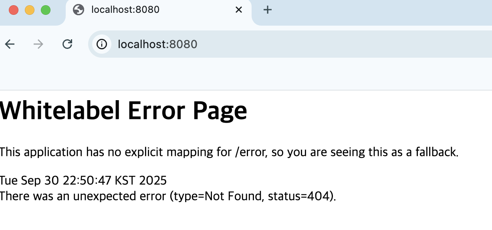

## 웹의 클라이언트 - 서버 모델

### URL(Uniform Resource Locator)

- Host: 리소스가 있는 서버의 IP 주소 또는 대체하는 도메인
- Port: 생략되어서 잘 볼 일 없다
- Path: 서버 내 리소스 경로
- Query: ? 뒤에 key-value &로 나열

### HTTP(HyperText Transper Protocol)

- 웹의 서버-클라이언트 모델 통신규약
- 요청과 응답으로 구성
- 무상태성(Stateless): 매 요청이 독립적, 이전 요청 저장 안 함
- 비연결성(Connectionless): 응답을 받은 클라이언트는 서버와 연결 해제

**HTTP 요청**

- start line
- headers
- body

**HTTP 주요 메서드**

- GET
- POST
- PUT
- PATCH
- DELETE

### REST(Representational State Transfer) API(Application Programming Interface)

HTTP에 가장 적합한 네트워크 아키텍처 

- 자원 (Resource) → URI로 식별
- 행위 (Verb) → HTTP Method
- 표현 (Representation) → JSON 형식

# RESTful하게 작성한 API 설계 명세서

## 회원 기능

1. 회원 등록
HTTP Method: POST
URI : /members
2. 회원 리스트 조회
HTTP Method: GET
URI: /members
3. 회원 상세 조회
HTTP Method : GET
URI: /members/{memberld}
4. 회원 정보 수정
HTTP Method: PATCH
URI: /members/{memberld}
5. 회원 삭제
HTTP Method: DELETE
URI: /members/{memberld}

## **상품 기능**

1. 상품 정보 등록

HTTP Method: POST
URI: /products

2. 상품 목록 조회

HTTP Method: GET
URI: /products

3. 개별 상품 정보 상세 조회

HTTP Method: GET
URI: /products/{productId}

4. 상품 정보 수정

HTTP Method: PATCH 또는 PUT
URI: /products/{productId}

5. 상품 삭제

HTTP Method: DELETE
URI: /products/{productId}

## **주문 기능**

1. 주문 정보 생성

HTTP Method: POST
URI: /orders

2. 주문 목록 조회

HTTP Method: GET
URI: /orders

3. 개별 주문 정보 상세 조회

HTTP Method: GET
URI: /orders/{orderId}

4. 주문 취소

HTTP Method: DELETE 또는 PATCH
URI: /orders/{orderId}
